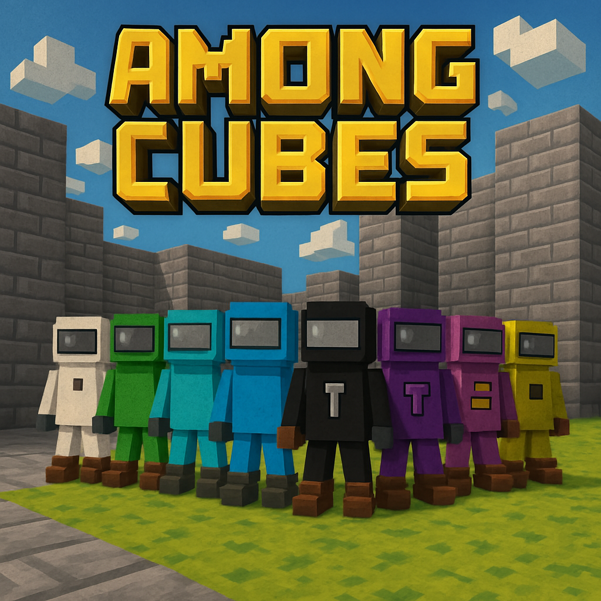

# Among Cubes

## What is Among Cubes?

Among Cubes is an online multiplayer social deduction game based on [Among Us](https://en.wikipedia.org/wiki/Among_Us), initially, developed to participate in Hytopia's [Game Jam 2](https://x.com/HYTOPIAgg/status/1906753533778473265).

### How does it work

The game features two distinct teams:

1. The Impostors
   - Currently consists of one player
   - Their goal is to secretly eliminate Crew members
   - Must avoid detection while carrying out their mission

2. The Crew
   - Made up of all other players
   - Must work together to complete various tasks
   - Need to identify and vote out the Impostor before too many crew members are eliminated

The game progresses through rounds of action and discussion. When a player discovers a eliminated crew member's body or calls an emergency meeting, all players gather to discuss their suspicions. 

During these meetings, players share information, defend themselves, and ultimately vote on who they believe is the Impostor. The player with the most votes is eliminated - choose wisely, as voting out a fellow Crew member only helps the Impostor's cause!

## Developer documentation

If you want to contribute or understand how the project works internally, go to the [Developer Documentation](docs/README.md).

## Built with AI

Among Cubes showcases the power of modern AI tools in game development. Nearly every aspect of the game was created using AI (even this documentation):

- **Code**: Developed using Cursor IDE with Sonnet 3.5, which provided intelligent code completion and generation while maintaining clean architecture and best practices

- **3D Models**: Created using [ChatGPT](https://chat.openai.com/) for conceptualization and [AssetHero](https://assethero.gbusto.com/model) for 3D model generation, including characters, props, and environmental assets

- **Music**: Original soundtrack composed by [Suno AI](suno.com), creating an atmospheric and engaging audio experience

The only component not originally created with AI was the game map, which was built using the Hytopia world editor. However, with Hytopia's recent release of their AI-driven world editor, even map creation can now be fully automated with AI assistance.

This project demonstrates how AI tools can be effectively combined to create a complete and polished game while maintaining high quality standards across all components.

