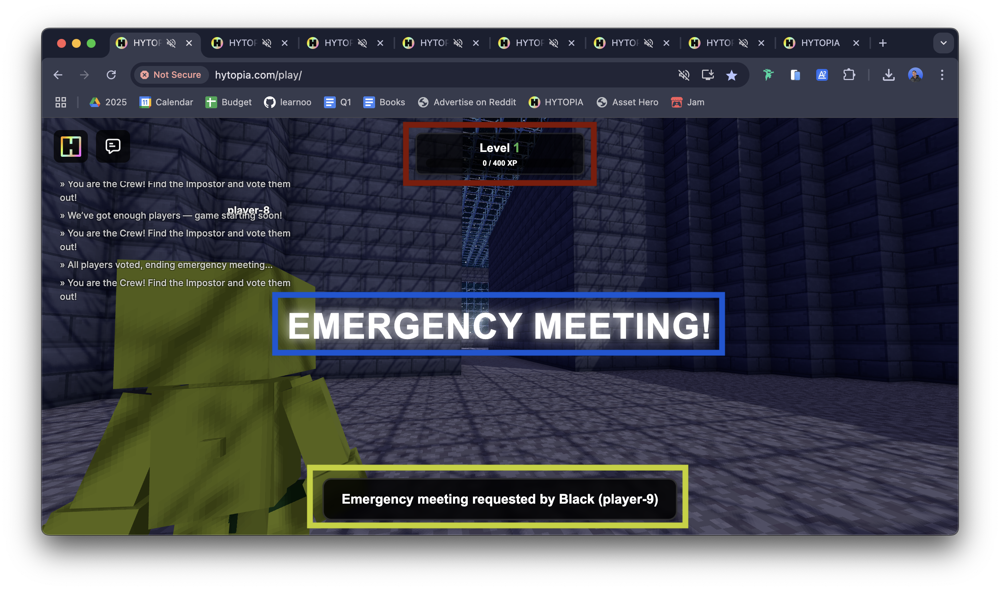
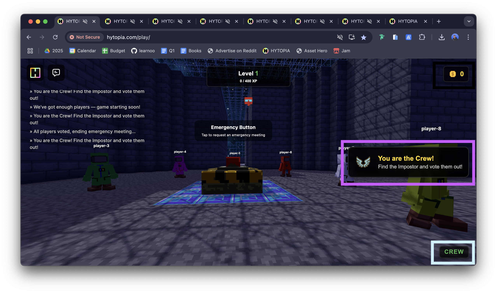

# Among Cubes UI Documentation

Most UI elements in Among Cubes are ephemeral, meaning they automatically disappear after a certain duration (typically 1000 milliseconds/1 second by default, unless specified otherwise). Here's a detailed breakdown of each UI element:




## Static UI Elements

### Level Display (Top Center, Red)
- **Location**: Top center of the screen
- **Behavior**: Static, always visible
- **Content**: Shows current level and XP progress
- **Components**:
  - Level number
  - XP progress bar
  - Current XP / Next Level XP
- **Updates**: Automatically updates based on `PlayerExperienceManager`
- **Method**: Updates through `sendLevelInfo()` in `PlayerSession`

## Ephemeral UI Elements

### Title (Center Screen, Blue)
- **Location**: Center of screen
- **Behavior**: Ephemeral (disappears after duration)
- **Default Duration**: 3000ms (3 seconds)
- **Method**: `title(title: string, milliseconds: number = 1000)`
- **Usage Example**:
```typescript
playerSession.title("Game Starting!", 3000);
```

### Popup (Bottom Center, Yellow)
- **Location**: Bottom center of screen
- **Behavior**: Ephemeral
- **Default Duration**: 1000ms (1 second)
- **Method**: `popup(message: string, subtitle: string | null, milliseconds: number = 1000)`
- **Usage Example**:
```typescript
playerSession.popup("You found a coin!", "Optional popup subtitle", 1000);
```



### Status Bar (Top Right, Black)
- **Location**: Top right corner
- **Behavior**: Ephemeral
- **Components**:
  - Coin count (always shown)
  - Optional time display
- **Method**: `statusBar({ coins, time, milliseconds })`
- **Usage Example**:
```typescript
playerSession.statusBar({
  coins: "10",
  time: "30", // Optional
  milliseconds: 1000
});
```

### Achievement (Middle Right, Pink)
- **Location**: Right side of screen
- **Behavior**: Ephemeral
- **Components**:
  - Icon
  - Title
  - Subtitle
- **Default Duration**: 1000ms
- **Method**: `achievement(title: string, subtitle: string, icon: string, milliseconds: number = 1000)`
- **Usage Example**:
```typescript
playerSession.achievement(
  "Achievement Unlocked!",
  "You found your first coin",
  "coin.png",
  3000
);
```

### Role Bar (Bottom Right)
- **Location**: Bottom right corner
- **Behavior**: Ephemeral
- **Components**:
  - Role text
  - Optional subtitle
  - Optional cooldown progress bar
- **Method**: `roleBar(title: string, subtitle: string, milliseconds: number = 1000, cooldown?: number)`
- **Usage Example**:
```typescript
playerSession.roleBar(
  "Impostor",
  "Knife Ready",
  1000,
  5000 // Optional cooldown in milliseconds
);
```
- **Special Method**: `sendRoleBar()` - Automatically updates the role bar with the player's current role and knife cooldown status

All these UI elements are designed to provide clear feedback to players while maintaining a clean interface by automatically removing temporary notifications after their duration expires.
